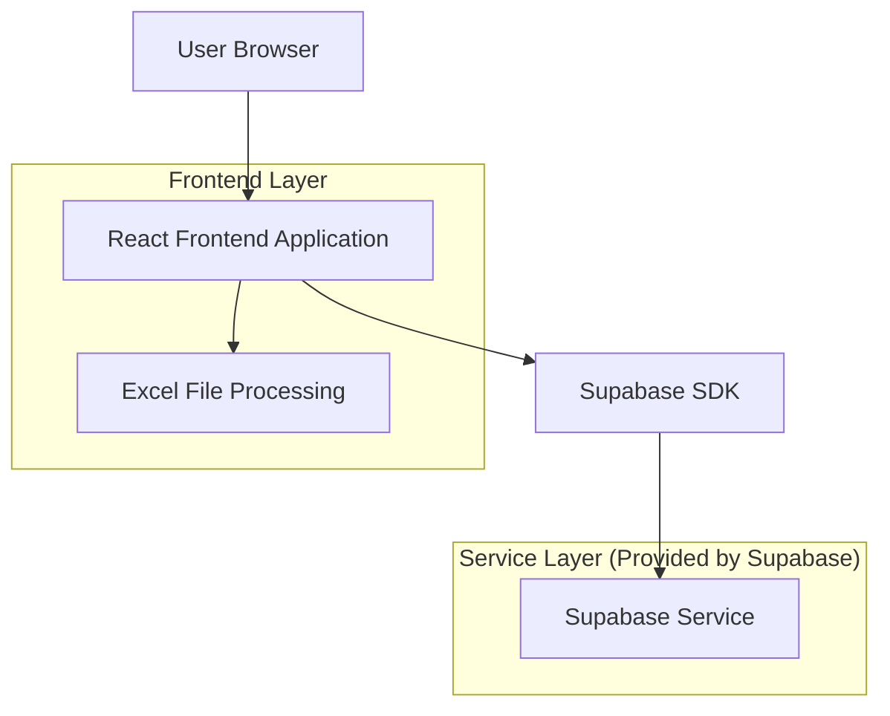
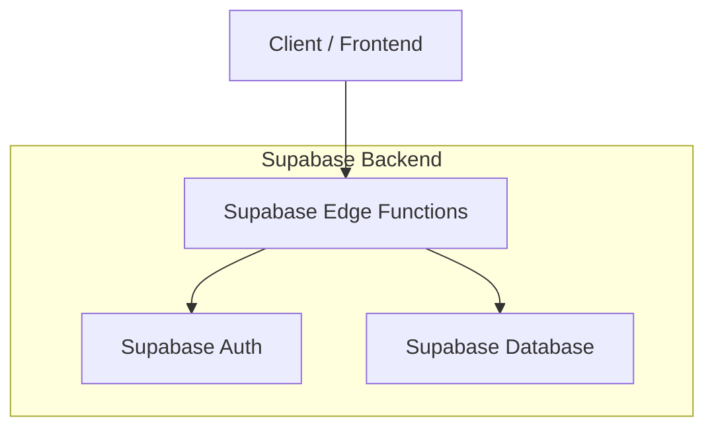
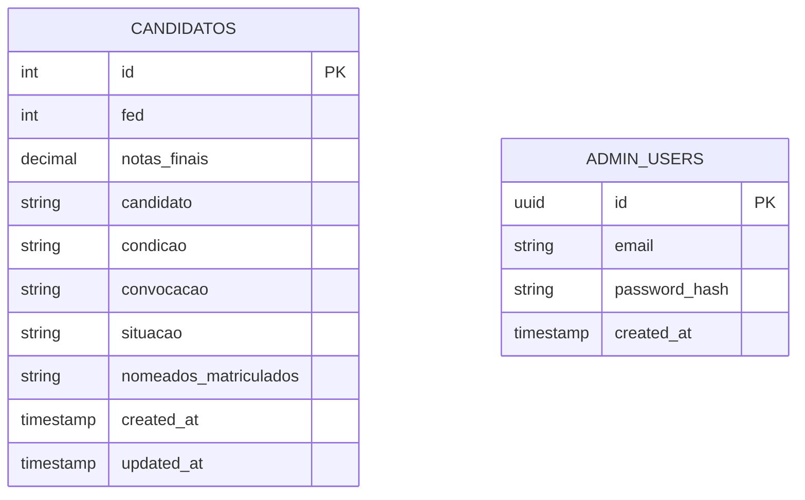

# Arquitetura Técnica - Painel CBMEPI

## 1. Architecture design



## 2. Technology Description

- Frontend: React@18 + tailwindcss@3 + vite + react-router-dom@6
- Backend: Supabase (Authentication + Database)
- File Processing: xlsx@0.18 (para leitura de arquivos Excel)
- UI Components: lucide-react@0.263 (ícones)

## 3. Route definitions

| Route | Purpose |
|-------|---------|
| / | Página principal com tabela de candidatos e filtros |
| /login | Página de login para administradores |
| /admin | Painel administrativo para upload de dados (protegido) |

## 4. API definitions

### 4.1 Core API

**Autenticação de usuário**
```
POST /auth/v1/token
```

Request:
| Param Name| Param Type  | isRequired  | Description |
|-----------|-------------|-------------|-------------|
| email     | string      | true        | Email do administrador |
| password  | string      | true        | Senha do administrador |

Response:
| Param Name| Param Type  | Description |
|-----------|-------------|-------------|
| access_token | string   | Token de acesso JWT |
| user      | object      | Dados do usuário autenticado |

**Buscar candidatos**
```
GET /rest/v1/candidatos
```

Query Parameters:
| Param Name| Param Type  | isRequired  | Description |
|-----------|-------------|-------------|-------------|
| nome      | string      | false       | Filtro por nome do candidato |
| situacao  | string      | false       | Filtro por situação |
| convocacao| string      | false       | Filtro por convocação |
| order     | string      | false       | Ordenação (ex: notas_finais.desc) |

Response:
```json
[
  {
    "id": 1,
    "fed": 181959,
    "notas_finais": 86,
    "candidato": "ELYDA RAVENNE RODRIGUES E SILVA",
    "condicao": "APTO",
    "convocacao": "T1",
    "situacao": "NOMEADO",
    "nomeados_matriculados": ""
  }
]
```

## 5. Server architecture diagram



## 6. Data model

### 6.1 Data model definition



### 6.2 Data Definition Language

**Tabela de Candidatos (candidatos)**
```sql
-- Criar tabela de candidatos
CREATE TABLE candidatos (
    id SERIAL PRIMARY KEY,
    fed INTEGER,
    notas_finais DECIMAL(4,1) NOT NULL,
    candidato VARCHAR(255) NOT NULL,
    condicao VARCHAR(50) NOT NULL,
    convocacao VARCHAR(10) NOT NULL,
    situacao VARCHAR(100) NOT NULL,
    nomeados_matriculados TEXT,
    created_at TIMESTAMP WITH TIME ZONE DEFAULT NOW(),
    updated_at TIMESTAMP WITH TIME ZONE DEFAULT NOW()
);

-- Criar índices para otimizar consultas
CREATE INDEX idx_candidatos_nome ON candidatos(candidato);
CREATE INDEX idx_candidatos_situacao ON candidatos(situacao);
CREATE INDEX idx_candidatos_convocacao ON candidatos(convocacao);
CREATE INDEX idx_candidatos_notas ON candidatos(notas_finais DESC);

-- Configurar RLS (Row Level Security)
ALTER TABLE candidatos ENABLE ROW LEVEL SECURITY;

-- Política para leitura pública
CREATE POLICY "Candidatos são visíveis para todos" ON candidatos
    FOR SELECT USING (true);

-- Política para inserção/atualização apenas para usuários autenticados
CREATE POLICY "Apenas admins podem modificar candidatos" ON candidatos
    FOR ALL USING (auth.role() = 'authenticated');

-- Dados iniciais fictícios
INSERT INTO candidatos (fed, notas_finais, candidato, condicao, convocacao, situacao, nomeados_matriculados) VALUES
(181959, 86.0, 'ELYDA RAVENNE RODRIGUES E SILVA', 'APTO', 'T1', 'NOMEADO', ''),
(184056, 86.0, 'MARIA CLARA ALBUQUERQUE ARAUJO BORGES', 'APTO', 'T1', 'DESLIGADO/NÃO TOMOU POSSE', ''),
(181448, 85.5, 'BRENDO LUCAS OLIVEIRA BORGES', 'APTO', 'T1', 'DESLIGADO/NÃO TOMOU POSSE', ''),
(184995, 85.5, 'JOSÉ FELIPE ALVES SAMPAIO', 'APTO', 'T1', 'NOMEADO', ''),
(182903, 85.0, 'JOSÉ LUCAS BARBADAS SILVA', 'APTO', 'T1', 'DESLIGADO/NÃO TOMOU POSSE', 'NOMEADO PP'),
(183191, 85.0, 'JOSIMO JOSÉ DOS SANTOS JUNIOR', 'APTO', 'T1', 'DESLIGADO/NÃO TOMOU POSSE', ''),
(184792, 84.5, 'GIOVANI AUGUSTO ARAUJO COSTA', 'APTO', 'T1', 'NOMEADO', ''),
(184870, 84.5, 'KAYO RENAN SANTOS COLARES', 'APTO', 'T2', 'MATRICULADO T2', ''),
(185915, 84.5, 'MARIA FRANCISCA DA SILVA PACHECO', 'APTO', 'T1', 'NOMEADO', ''),
(181476, 84.0, 'ALYNNE LARA DA SILVA ARAUJO', 'APTO', 'T1', 'NOMEADO', ''),
(181356, 84.0, 'MÔNICA LETÍCIA ALVES SOARES', 'APTO', 'T1', 'NOMEADO', ''),
(181392, 83.5, 'JOÃO ALVES DA SILVA JÚNIOR', 'APTO', 'T1', 'NÃO MATRICULADOS', ''),
(182408, 83.5, 'MARCOS ANDRÉ DE SOUSA SILVA', 'APTO', 'T1', 'NOMEADO', ''),
(181926, 82.0, 'ANTONIA KAROLINE DE OLIVEIRA SOUSA', 'APTO', 'T1', 'NOMEADO', ''),
(183864, 82.0, 'DENISE CLARA DE ARAUJO SILVA', 'APTO', 'T1', 'NOMEADO', ''),
(185767, 82.0, 'ERIKA FERREIRA E LIRA OLIVEIRA', 'APTO', 'T1', 'NOMEADO', ''),
(184949, 82.0, 'FELIPE DA SILVA VILELA', 'APTO', 'T1', 'NOMEADO', ''),
(183221, 82.0, 'JHONÁS PAULA DA SILVA', 'APTO', 'T1', 'NOMEADO', ''),
(183023, 82.0, 'MATHEUS STANLEY LEAL DOS SANTOS', 'APTO', 'T2', 'MATRICULADO T2', '');

-- Permissões para roles do Supabase
GRANT SELECT ON candidatos TO anon;
GRANT ALL PRIVILEGES ON candidatos TO authenticated;
```

**Configuração de Autenticação**
```sql
-- A autenticação será gerenciada pelo Supabase Auth
-- Criar usuário administrador inicial via Supabase Dashboard
-- Email: admin@cbmepi.pi.gov.br
-- Senha: definida durante configuração inicial
```