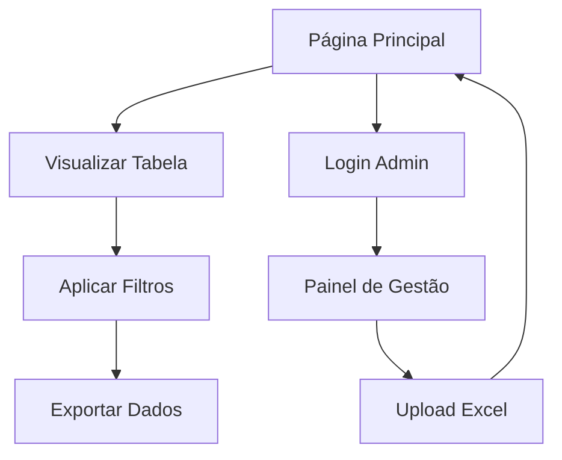

# Painel de Candidatos - Corpo de Bombeiros Militar do Piauí

## 1. Product Overview

Sistema web para exibição da lista de candidatos do concurso do Corpo de Bombeiros Militar do Estado do Piauí, permitindo visualização completa e organizada dos dados dos candidatos aprovados e suas respectivas situações.

O painel oferece uma interface simples e profissional para consulta pública dos resultados do concurso, facilitando o acesso às informações pelos candidatos e pela administração pública.

## 2. Core Features

### 2.1 User Roles

| Role | Registration Method | Core Permissions |
|------|---------------------|------------------|
| Visitante | Acesso direto (sem registro) | Visualizar lista completa de candidatos e filtrar dados |
| Administrador | Acesso restrito com credenciais | Atualizar dados dos candidatos e gerenciar conteúdo |

### 2.2 Feature Module

O painel de candidatos do CBMEPI consiste nas seguintes páginas principais:

1. **Página Principal**: cabeçalho institucional, tabela de candidatos, filtros de busca
2. **Página de Login** (admin): formulário de autenticação para administradores

### 2.3 Page Details

| Page Name | Module Name | Feature description |
|-----------|-------------|---------------------|
| Página Principal | Cabeçalho Institucional | Exibir título "Lista de Candidatos do Curso de Bombeiros Militar do Estado do Piauí" com identidade visual dos bombeiros |
| Página Principal | Tabela de Candidatos | Exibir todos os candidatos com colunas: Fed, Notas Finais, Candidato, Condição, Convocação, Situação, Nomeados/Matriculados |
| Página Principal | Sistema de Filtros | Filtrar por nome do candidato, situação, convocação e ordenar por notas finais |
| Página Principal | Exportação de Dados | Permitir download da lista em formato Excel e PDF |
| Página de Login | Formulário de Autenticação | Validar credenciais de administrador para acesso ao painel de gestão |
| Página de Login | Painel de Gestão | Carregar novo arquivo Excel com dados atualizados dos candidatos |

## 3. Core Process

**Fluxo do Visitante:**
O usuário acessa a página principal e visualiza automaticamente a tabela completa de candidatos. Pode utilizar os filtros para buscar candidatos específicos por nome, situação ou convocação. Também pode ordenar a lista por notas finais e exportar os dados filtrados.

**Fluxo do Administrador:**
O administrador acessa a página de login, insere suas credenciais e é direcionado ao painel de gestão onde pode fazer upload de um novo arquivo Excel para atualizar os dados dos candidatos no sistema.

## 4. User Interface Design

### 4.1 Design Style

- **Cores Primárias**: Laranja (#FF6B35) e Vermelho (#DC143C) - cores oficiais dos bombeiros
- **Cores Secundárias**: Branco (#FFFFFF) para fundos e Cinza escuro (#2C3E50) para textos
- **Estilo de Botões**: Botões arredondados com gradiente laranja-vermelho e efeito hover
- **Fonte**: Roboto ou Arial, tamanhos 16px para texto normal, 24px para títulos, 14px para tabelas
- **Layout**: Design limpo e profissional com cabeçalho fixo e tabela responsiva
- **Ícones**: Ícones relacionados aos bombeiros (escudo, capacete) e ícones funcionais (filtro, download)

### 4.2 Page Design Overview

| Page Name | Module Name | UI Elements |
|-----------|-------------|-------------|
| Página Principal | Cabeçalho Institucional | Fundo gradiente laranja-vermelho, logo dos bombeiros, título em branco bold 28px, brasão do Piauí |
| Página Principal | Tabela de Candidatos | Tabela responsiva com cabeçalho vermelho, linhas alternadas branco/cinza claro, bordas sutis |
| Página Principal | Sistema de Filtros | Barra de filtros com campos de busca em branco, botões laranja com ícones, dropdown estilizado |
| Página Principal | Exportação de Dados | Botões flutuantes no canto direito, ícones de Excel e PDF, cores institucionais |
| Página de Login | Formulário de Autenticação | Card centralizado branco com sombra, campos com bordas laranjas, botão vermelho |

### 4.3 Responsiveness

O sistema é desenvolvido com abordagem mobile-first, garantindo perfeita visualização em dispositivos móveis, tablets e desktops. A tabela utiliza scroll horizontal em telas menores e os filtros se reorganizam verticalmente em dispositivos móveis.